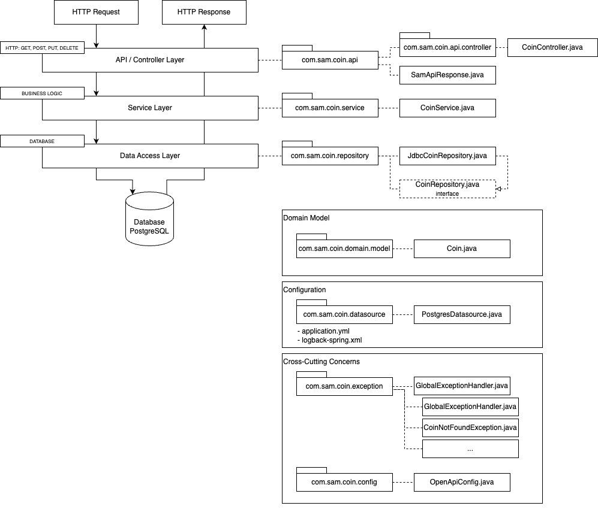
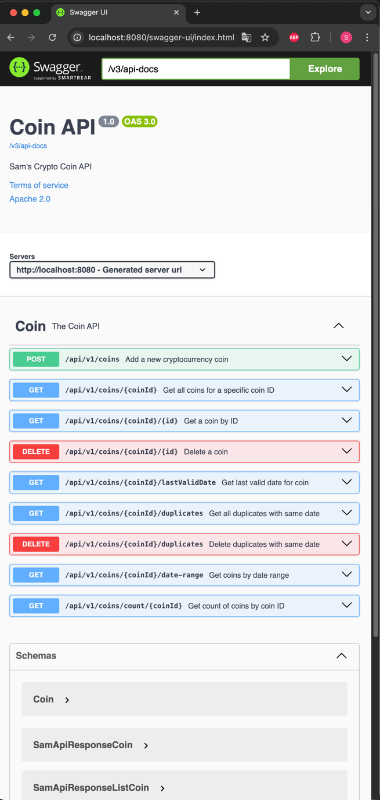

# Crypto Monitor API POC

## Table of Contents
1. [Purpose](#purpose)
2. [Technology Stack](#technology-stack)
3. [Prerequisites](#prerequisites)
4. [Quick Start Guide](#quick-start-guide)
5. [Detailed Setup](#detailed-setup)
6. [API Usage](#api-usage)
7. [Database Management](#database-management)
8. [Grafana Integration](#grafana-integration)
9. [Development Guidelines](#development-guidelines)
10. [Troubleshooting](#troubleshooting)
11. [Additional Information](#additional-information)

## Purpose

This application serves as a Proof of Concept (POC) with the following objectives:
- Provide a playground for data visualization and statistics
- Connect multiple Docker-based services to establish a data source for Grafana dashboards for monitoring cryptocurrency information
- Implement a Maven-based Spring Boot backend application with a REST API for CRUD operations on cryptocurrency information, persisted in a PostgreSQL database
- Utilize a separate crypto client (covered separately) as an intermediary between the cryptocurrency web service (coingecko.com) and this Spring Boot backend server

### Architecture



## Technology Stack

- Java 21 (Eclipse Temurin)
- Spring Boot 3.3.3
- PostgreSQL
- Flyway for database migrations
- Spring JDBC with JdbcTemplate
- HikariCP for connection pooling
- Lombok for reducing boilerplate code
- SpringDoc OpenAPI for API documentation
- Docker for containerization

> **Note:** This application uses [Eclipse Temurin Java 21 LTS](https://adoptium.net/de/temurin/releases/). If you encounter any compile issues, please ensure you're using this version.

## Prerequisites

- Java 21 (Eclipse Temurin) installed
- Docker installed
- Maven installed
- Git bash (for Windows users)

## Quick Start Guide

1. Clone the repository
2. Start the PostgreSQL database and pgAdmin:
   ```
   docker-compose up -d
   ```
3. Create the 'coin' database and set up the UUID extension (see [Database Setup](#database-setup) for detailed steps)
4. Build the Spring Boot application from its root directory:
   ```
   mvn clean install
   ```
5. Run the application:
   ```
   java -jar target/coin-exec.jar
   ```
6. Access the API at `http://localhost:8080`
7. View API documentation at `http://localhost:8080/api-docs`

## Detailed Setup

### Database Setup

1. Start PostgreSQL container:
   ```
   docker compose up -d
   ```
2. Connect to the PostgreSQL container:
   ```
   docker exec -it postgres-coin psql -U postgres
   ```
3. Create the 'coin' database:
   ```sql
   CREATE DATABASE coin;
   ```
4. Connect to the 'coin' database:
   ```sql
   \c coin
   ```
5. Create the UUID extension:
   ```sql
   CREATE EXTENSION IF NOT EXISTS "uuid-ossp";
   ```
6. Exit the PostgreSQL prompt:
   ```
   \q
   ```
7. Add sample data (optional):
   ```
   cd crypto-monitoring-api-poc/misc/dbbackup
   unpack coinbackup.rar
   docker exec -i postgres-coin psql -U postgres -d coin < coinbackup.sql
   ```

### Application Setup

1. Build the application from its root directory:
   ```
   mvn clean install
   ```
2. Run the application:
   ```
   java -jar target/coin-exec.jar
   ```
   Alternatively, import the project into your IDE and run it from there.

## API Usage

The API runs on `http://localhost:8080`. You can use tools like Postman or curl to interact with the endpoints.

To explore and test the API:
1. Access Swagger UI at `http://localhost:8080/api-docs`

 

2. Use the interactive documentation to understand and test available endpoints

## Database Management

### Using pgAdmin

1. Access pgAdmin at `http://localhost:5050`
2. Login with:
    - Email: `user@example.com`
    - Password: `password`
3. Right click on Servers > Register > Server ... > Add some Name in Tab "General", for example 'CryptoDB' >  click on Tab "Connection" 
4. Add a new server in pgAdmin:
    - Host name/address: `postgres`
    - Port: `5432`
    - Maintenance database: `coin`
    - Username: `postgres`
    - Password: `password`

### Manual Database Access

To access the PostgreSQL database directly:

1. Connect to the container:
   ```
   docker exec -it postgres-coin bin/bash
   ```
2. Access PostgreSQL:
   ```
   psql -U postgres
   ```
3. Connect to the 'coin' database:
   ```
   \c coin
   ```

Common PostgreSQL commands:
- List all databases: `\l`
- Show all tables: `\dt`
- Query all content from a table: `SELECT * FROM table_name;`

## Grafana Integration

1. Start Grafana:
   ```
   docker run -d --name=grafana -p 3000:3000 grafana/grafana
   ```
2. Access Grafana at `http://localhost:3000` (default credentials - user:admin, password:admin)
3. Add PostgreSQL as a data source:
    - Host: `host.docker.internal:5432`
    - Database: `coin`
    - User: `postgres`
    - Password: `password`
    - SSL Mode: `disable`
4. Import dashboards from `misc/grafana/*.json`

## Development Guidelines

### Adding New Database Migrations

1. Create a new SQL file in `src/main/resources/db/migration`
2. Name it following the pattern `V<version>__<description>.sql`
3. Write your SQL migration script
4. The migration will be automatically applied on the next application startup

### Using JdbcTemplate for Database Operations

Inject `JdbcTemplate` into your repository classes and use it for querying and modifying data. Example:

```java
@Repository
public class CoinRepositoryImpl implements CoinRepository {
    private final JdbcTemplate jdbcTemplate;

    public CoinRepositoryImpl(JdbcTemplate jdbcTemplate) {
        this.jdbcTemplate = jdbcTemplate;
    }

    // Use jdbcTemplate for database operations
}
```

## Troubleshooting

- If you encounter database connection issues, ensure the PostgreSQL container is running and the connection details in `application.yml` are correct.
- For API-related problems, check the application logs and ensure all prerequisites are met.
- If Grafana dashboards are not displaying data, verify the data source configuration and ensure the database contains data.

## Additional Information

### Running the Application in Docker

1. Create a Docker network:
   ```
   docker network create coin-network
   ```
2. Add PostgreSQL container to the network:
   ```
   docker network connect coin-network postgres-coin
   ```
3. Build the application from its root directory:
   ```
   mvn clean install
   ```
4. Build Docker image for the applications root directory:
   ```
   docker build -t coin-app .
   ```
5. Run the application container:
   ```
   docker run --name coin-container \
              --network coin-network \
              -p 8080:8080 \
              -e CRYPTO_API_DB_URL=jdbc:postgresql://postgres-coin:5432/coin \
              -e CRYPTO_API_DB_USERNAME=postgres \
              -e CRYPTO_API_DB_PASSWORD=password \
              coin-app
   ```

### Logging

- Logging configuration is in `src/main/resources/logback-spring.xml`
- Two profiles available: `dev` (console logging) and `prod` (file logging to `logs/app.log`)
- Activate profiles in `src/main/resources/application.yml`

### Adding New Coin Data

To add new cryptocurrency data, utilize the [crypto-client-poc](https://github.com/src-dbgr/crypto-client-poc).