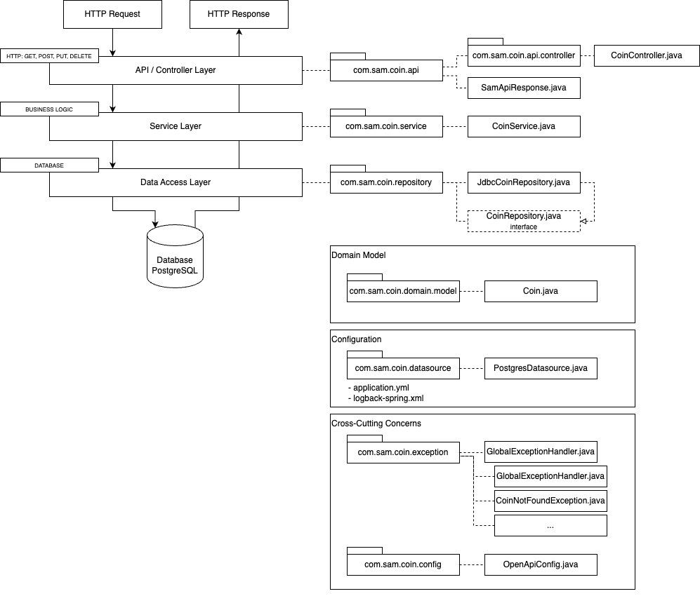
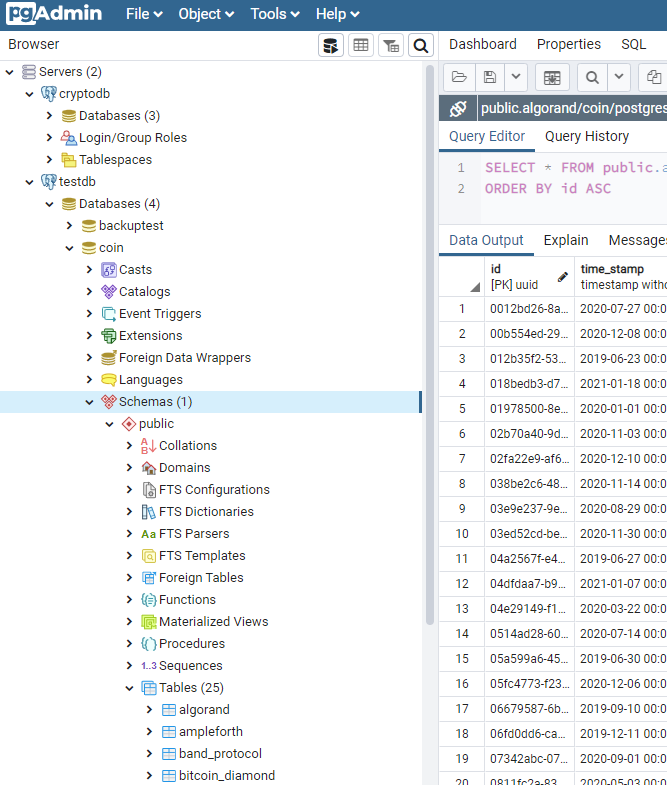
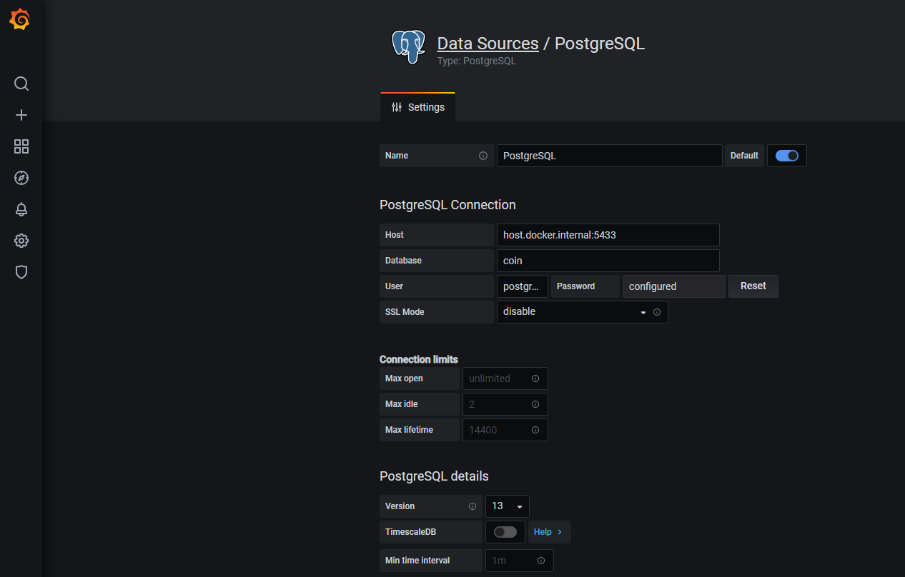
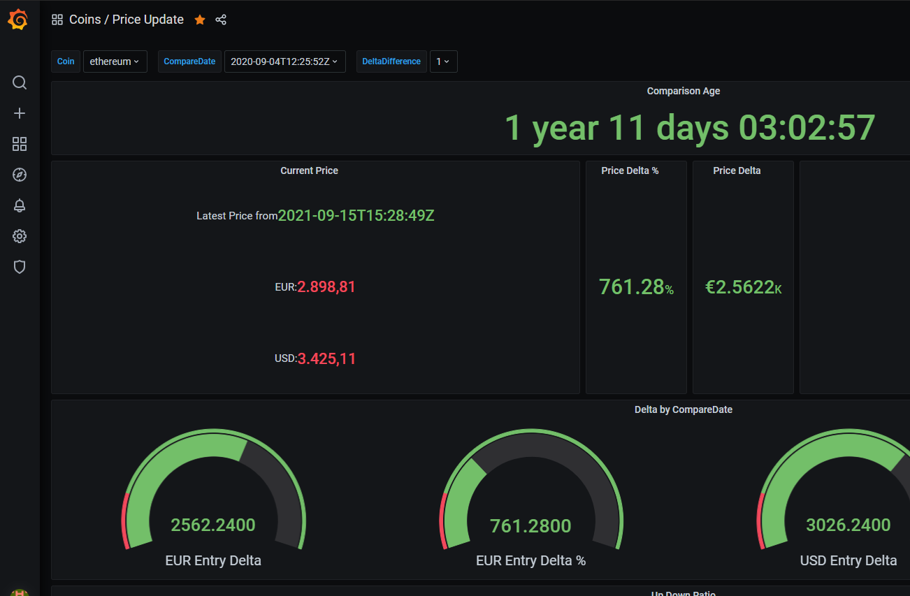

# Crypto Monitor Api POC

## Purpose of this application

- This application is part of a POC which aims at the following
  - Playground for Data visualization and statistics 
  - Connecting multiple Docker-based services to establish a data source for Grafana dashboards where monitoring of cryptocurrency information shall take place
  - This Maven-based Spring Boot backend application shall provide a REST API that handles CRUD operations persisted in a PostgreSQL database for Cryptocurrency information such as price performance over time
  - For price updates, a separate crypto client is in place (the client is covered separately), which serves as the man in the middle between the cryptocurrency web service (in this case, coingecko.com) and this Spring Boot backend server

## Technology Stack
- Java 21 (Eclipse Temurin)
- Spring Boot 3.3.3
- PostgreSQL
- Flyway for database migrations
- Spring JDBC with JdbcTemplate
- HikariCP for connection pooling
- Lombok for reducing boilerplate code
- SpringDoc OpenAPI for API documentation
- Docker for containerization

> **Note:** In case there are any compile issues, I used [Eclispe Temurin Java 21 LTS](https://adoptium.net/de/temurin/releases/) for this application.

> **Note:** The following description contains essential steps for starting the application and helpful background information. Essential steps are highlighted with [IMPORTANT].

## Prerequisites

- You have Java installed. Check above which version I have used in case of encountering issues
- You have Docker installed on your machine
- You have Maven installed
- Git bash (if you are on Windows)

## Setup

1. Clone the repository:

2. Navigate to the root of the repo and start the PostgreSQL database and pgAdmin:
   ```
   docker-compose up -d
   ```

3. Wait for about 10-15 seconds to ensure the PostgreSQL container is fully up and running.

4. Connect to the PostgreSQL container:
   ```
   docker exec -it postgres-coin psql -U postgres
   ```

5. Create the 'coin' database:
   ```sql
   CREATE DATABASE coin;
   ```

6. Connect to the 'coin' database:
   ```sql
   \c coin
   ```

7. Create the UUID extension:
   ```sql
   CREATE EXTENSION IF NOT EXISTS "uuid-ossp";
   ```

8. Exit the PostgreSQL prompt:
   ```
   \q
   ```

9. Add some data to the Database.
   * 9.1. cd into `crypto-monitoring-api-poc/misc/dbbackup`
   * 9.2. unpack `coinbackup.rar`
   * 9.3. add data to `coin` database
   ```
   docker exec -i postgres-coin psql -U postgres -d coin < coinbackup.sql
   ```

10. Build the Spring Boot application:
   ```
   mvn clean install -DskipTests
   ```

11. Run the Spring Boot application:
    ```
    java -jar target/coin-exec.jar
    ```
    Or simply import it into your IDE and start it there. It will run at port 8080.    

7. Monitor Flyway migrations (You can perform this step also when pgAdmin is installed as the GUI makes it easier to visualize the tables):
- Check application logs for Flyway-related messages during startup.
- After startup, you can verify migrations by checking the `flyway_schema_history` table in your database.

## Set Up Grafana

1. Open Grafana in your browser `localhost:3000` and login (usually the initial access it's user: admin, pw: admin)
2. Add a new PostgreSQL Datasource. Connections > Data Sources > + Add new data source > postgres > Connection:HostURL = host.docker.internal:5432, Database name: coin, Username: postgres, TLS/SSL Mode: disable > Save & test 
3. Click on `Build a dashboard`
4. Choose "Import dashboard"
5. Choose "Upload dashboard JSON file"
6. Select a JSON file from `crypto-monitoring-api-poc\misc\grafana\<some-file-name>.json`
7. Click on "Import"
8. Save the dashboard if there are no errors

## Accessing pgAdmin

1. Open a web browser and go to `http://localhost:5050`
2. Login with:
  - Email: `user@example.com`
  - Password: `password`
3. Right click on Servers > Register > Server ... > Add some Name in Tab "General" >  click on Tab "Connection"
4. Add a new server in pgAdmin:
  - Host name/address: `postgres`
  - Port: `5432`
  - Maintenance database: `coin`
  - Username: `postgres`
  - Password: `password`

## API Usage

The API should now be running on `http://localhost:8080`. You can use tools like Postman or curl to interact with the endpoints defined in your controllers.

To explore and test the API:
1. Access the Swagger UI at `http://localhost:8080/api-docs`
2. Use the interactive documentation to understand and test the available endpoints.

## Stopping the Application

1. Stop the Spring Boot application (Ctrl+C in the terminal where it's running)
2. Stop the Docker containers:
   ```
   docker-compose down
   ```

## Additional Notes

- The database schema is managed by Flyway migrations. Migration scripts are located in `src/main/resources/db/migration`.
- Separate tables are used for different cryptocurrencies (e.g., ethereum, algorand, etc.).
- The `application.yml` file in the Spring Boot project is configured to connect to the PostgreSQL database and manage Flyway migrations:

  ```yaml
    app:
      datasource:
        jdbc-url: jdbc:postgresql://localhost:5432/coin
        username: postgres
        password: password
        pool-size: 30
  ```

- If you need to make any manual changes to the database schema or add initial data, you can do so by connecting to the database using the steps 4-8 above.

## Development Guidelines

### Adding New Database Migrations
1. Create a new SQL file in `src/main/resources/db/migration`
2. Name it following the pattern `V<version>__<description>.sql` (e.g., `V2__Add_New_Coin_Table.sql`)
3. Write your SQL migration script
4. The migration will be automatically applied on the next application startup

### Using JdbcTemplate for Database Operations
- Inject `JdbcTemplate` into your repository classes
- Use `JdbcTemplate` methods for querying and modifying data
- Example:
  ```java
  @Repository
  public class CoinRepositoryImpl implements CoinRepository {
      private final JdbcTemplate jdbcTemplate;

      public CoinRepositoryImpl(JdbcTemplate jdbcTemplate) {
          this.jdbcTemplate = jdbcTemplate;
      }

      // Use jdbcTemplate for database operations
  }
  ```

## Error Handling and Logging

- Global exception handling is implemented in `GlobalExceptionHandler.java`
- Logging is configured in `logback-spring.xml`
- Application logs can be found in the `logs` directory

### Starting the application

- Before this application can be started, there are some steps to be taken, such as setting up a local docker database described in the following steps. However, the class you will need eventually to run is: "CoinApplication.java" but step by step. Here are some general Infos which you should notice:
  - [INFO] The application runs on `localhost:8080/`
  - [INFO] You may check later which Database implementation is used in `CoinService.java` - check the description below how to swap the implementation
  - [INFO] If a PostgresDB is used, make sure the Docker Container with the DB is started accordingly - check the description below how to achieve that

### Architecture



## Adding new Coin Data
* In order to add some new crypto data you can utilize the [crypto-client-poc](https://github.com/src-dbgr/crypto-client-poc)

## The following section covers general information that should ease troubleshooting or setup issues

### [INFO] Extending or Changing Database Implementation

To extend or change the database implementation, follow these steps:

1. Create a new implementation of the `CoinRepository` interface:
    - Create a new class in the `com.sam.coin.repository` package
    - Implement all methods defined in `CoinRepository`

2. Annotate your new class with `@Repository` and give it a unique name:
   ```java
   @Repository("newDatabaseImpl")
   public class NewDatabaseRepository implements CoinRepository {
       // Implementation
   }
   ```

3. In `CoinService.java`, use the `@Qualifier` annotation to specify which implementation to use:
   ```java
   @Service
   public class CoinService {
       private final CoinRepository coinRepository;

       public CoinService(@Qualifier("newDatabaseImpl") CoinRepository coinRepository) {
           this.coinRepository = coinRepository;
       }
       // Rest of the service
   }
   ```

4. Update `application.yml` with any new database connection properties if required.

5. If using a different database system, add appropriate dependencies to `pom.xml`.

> **Note:** Ensure your new implementation handles all necessary database operations and follows the same transaction management approach as the existing implementation.

### [INFO] Logging

- Logging behavior is defined in `src/main/resources/logback-spring.xml`
- Two profiles are available: `dev` and `prod`
- `prod` logs to a file `app.log` in the `logs` folder
- `dev` logs to the console
- Activate either profile in `src/main/resources/application.yml`

### [IMPORTANT] Database Configuration

- Database connection properties are in `src/main/resources/application.yml`
- Ensure these properties match your PostgreSQL setup:
  ```yaml
  app:
    datasource:
      jdbc-url: jdbc:postgresql://localhost:5432/coin
      username: postgres
      password: password
      pool-size: 30
  ```
- This configuration is used in `PostgresDatasource.java`
- For more details on custom DataSource configuration, refer to the [Spring Boot Documentation](https://docs.spring.io/spring-boot/docs/current/reference/html/howto.html#howto-configure-a-datasource)

### [INFO] Create or Update a DB Table within your IDE

1. Create folders `db/migration` within `src/main/resources` in the project.
2. Create a File named `V1__<Some Name>Table.sql`
   > **Note:** By default, Flyway looks at files in the format `V{VERSION_NUMBER}__{DESCRRIPTION}.sql`, for example `V3__ADD_NEW_CRYPTO`, in folder src/main/resources/db/migration.
   > Go to https://flywaydb.org/documentation/api/ to find more details
3. Insert the following SQL command
   `CREATE TABLE coin ( id UUID NOT NULL PRIMARY KEY, name VARCHAR(100) NOT NULL );`

### [IMPORTANT] Initial Start a Postgres DB in a Docker Container

`docker run --name <your_docker_postgres_db_name> -e POSTGRES_PASSWORD=password -d -p 5432:5432 postgres:alpine`

> **Note:** Do not use Git Bash for the following commands
> **Note:** The default Postgres Port is 5432. The param -p maps the internal port to an external port.

### [INFO] List all containers

`docker ps -a`

### Start a stopped Docker Container Postgres DB

`docker start /<your_docker_postgres_db_name>`

> **Note:** The command `docker run` should have been already applied, and the container must be stopped and should be available for start

### [IMPORTANT] Show running Docker files to find your <your_docker_postgres_db_name> Container ID

`docker ps`

### [IMPORTANT] Enter the Docker Container via command-line interface

`docker exec -it <CONTAINER ID> bin/bash`

> **Note:** execute docker ps first to retrieve the CONTAINER ID
> **Note:** The result should look something like this:
> `bash-5.0#`

### [IMPORTANT] Access the Postgres DB

`bash-5.0# psql -U postgres`

### [INFO] List all Databases

`postgres=# \l`

### [IMPORTANT] Create a Database

`postgres=# CREATE DATABASE <databasename>;`

> **Note:** The database name in this example is `coin`

### [IMPORTANT] Connect to the created Database

`postgres=# \c <databasename>`

> **Note:** in this example: `postgres=# \c coin`

### [INFO] Show all Databases

`postgres=# \d`

### [INFO] Show all Database Tables

`postgres=# \dt`

### [IMPORTANT] Install UUID Generation Extension to Postgres DB

`postgres=# CREATE EXTENSION "uuid-ossp";`

### [IMPORTANT] Test UUID Extension in Postgres DB. This should output something

`postgres=# SELECT uuid_generate_v4();`

### [INFO] Query all Content from Table `coin`

`SELECT * FROM coin;`

### [IMPORTANT] Exit the DB for now by typing

`exit` until you have exited the DB

### [IMPORTANT] I recommend administering the DB via pgAdmin since it is straightforward to use and more user friendly

`docker pull dpage/pgadmin4`

### [IMPORTANT] Run pgAdmin

`docker run -p 80:80 -e "PGADMIN_DEFAULT_EMAIL=<your mail address>" -e "PGADMIN_DEFAULT_PASSWORD=password" -d dpage/pgadmin4`

### [IMPORTANT] Access pgAdmin from Browser

`localhost:80`

### [IMPORTANT] Login to pgAdmin from Browser

Username: `<your mail address>`
PW: `password`

### [IMPORTANT] Add Postgres Server to pgAdmin

> **Note:** In case you want to access the Postgres Database, which runs in the Docker Container from within pgAdmin

- Click "Add New Server"
- Click Tab "Connection"
- Add the following properties

> Host name/address: `host.docker.internal`

> Port: `5432`

> Maintenance database: `coin`

> User name: `postgres`

> Password: `password`

- Click Save
- You should now be connected



### [IMPORTANT] Check that the src/main/resources/application.yml file has

- the correct port in jdbc-url (5432) in this example
- the correct suffix in jdbc-url (coin) for this example
- the correct username (postgres) in this example
- the correct password (password) in this example

### [IMPORTANT] Run CoinApplication.java

- If the Database is running and exposed to port 5432 you should run the application
- You can check whether the application is reachable by firing a get request to localhost:8080/
- You should see the following message: "Crypto Coin API is served under path: /api/v1/coin"
- You can now also use Postman to post some data to the API.
  - Create a new POST Request
  - enter `localhost:8080/api/v1/coin`
  - paste the following content into the Body field:
```
{
   "id":"24649f69-f963-4358-8df5-7716cd5ca520",
   "timestamp":1631728657000,
   "symbol":"algo",
   "coinId":"algorand",
   "coinName":"Algorand",
   "priceEur":1.75,
   "priceUsd":2.06,
   "priceBtc":0.00004278,
   "priceEth":0.00058266,
   "marketCapEur":9129540478.621513,
   "marketCapUsd":10782459113.315432,
   "marketCapBtc":223272.92629636533,
   "marketCapEth":3044854.898276552,
   "totalVolumeEur":630063059.8750135,
   "totalVolumeUsd":744086064.2790741,
   "totalVolumeBtc":15443.646497872505,
   "totalVolumeEth":210319.25611616662,
   "twitterFollowers":0,
   "redditAvgPosts48Hours":null,
   "redditAvgComments48Hours":null,
   "redditAccountsActive48Hours":null,
   "redditSubscribers":0,
   "devForks":0,
   "devStars":0,
   "devTotalIssues":0,
   "devClosedIssues":0,
   "devPullRequestsMerged":0,
   "devPullRequestContributors":0,
   "devCommitCount4Weeks":0,
   "devCodeAdditions4Weeks":0,
   "devCodeDeletions4Weeks":0,
   "publicAlexaRank":0
}
```
- Pray :D, now if everything worked fine, you should receive a 200 response, and a new entry should be made into the Postgres DB table "algorand"

### [IMPORTANT] Refresh pgadmin to verify if the DB scripts have been applied

- Reaccess pgadmin and refresh coin
- Drill down to coin > coin > Schemas > Tables, and you should see ~ 25 Tables that have been created
- However, there is no Data. If you would like to continue with the data I have already downloaded, you should apply the following database backup

### [RECOMMENDED] I have only tested the application of my backup to a clean database thus, I recommend the following (But I think it should also work for coin)

- In pgAdmin, create a new database by right click n the elephant symbol "coin" > create > Database...
- Call it "cryptobackup" for instance
- in misc/dbbackup/coinbackup.sql is the file (I will probably zip it later, so unzip it if so). This is the backup you should apply to your newly created Database with the following command:

  `cat coinbackup.sql | docker exec -i <your_docker_postgres_container_name> psql -U postgres -d cryptobackup`

- If everything works, you should be able to refresh in cryptobackup in pgAdmin and see content in the tables.
- NOTE: If you want to use this Database from now with the Spring Boot API, don't forget to adjust "application.yaml" accordingly by changing the URL suffix from "coin" to "cryptobackup"

### [INFO] You may want to build a Docker Container for this Spring Boot application

- go into the project directory
- execute:

  `docker build -f Dockerfile -name docker-spring-boot -t docker-spring-boot .`

### [INFO] Run this application in a Docker Container

`docker run -d -p 8080:8080 --name docker-spring-boot docker-spring-boot`

> **Note:** Running the app in a Docker Container requires a change in 'application.yaml' to find the Database, the following line needs to be entered:
> `jdbc-url: jdbc:postgresql://host.docker.internal:5432/cryptobackup`

### [RECOMMENDED]

- To connect the DB to Grafana, you need a running Docker Grafana Container
- Run the following command for that:

`docker run -d --name=grafana -p 3000:3000 grafana/grafana`

- open `localhost:3000` in your browser and use user/pw: `admin`
- Now you need to plug in the datasource
  - Click on the gear wheel on the left side > Configuration > Data Sources > Add data source
  - Choose PostgreSQL
  - Give it some name
    - Host: `host.docker.internal:5432`
    - Database: `coin`
    - User: `postgres`
    - Password: `password`
    - SSL Mode: `disable` (since it runs only local this is ok)
  - Click "Save & Test"
  - It should be able to communicate to the DB



- Now, you will still not see anything. This is because you are missing the Dashboards.
  - In Grafana click on the "+" symbol in the left menu > Import > Upload JSON File
  - Now choose `misc/grafana/<some dashboard name>.json`, which I have provided, and upload it
  - Once you have all uploaded, you should finally have the dashboards available in Grafana
  - You should now be able to open a dashboard and play around with the data :)



### [INFO] Fetching Coin Data

- You may want to update coin information, for this purpose [crypto-client-poc](https://github.com/src-dbgr/crypto-client-poc) is available

### [INFO] Start / Stop Stack

- For simplicity, I have added some simple batch scripts which start
- Stack contains: Postgres DB Docker Container, Spring Boot App Docker Container, Grafana Docker Container
  Start: `misc\start-docker.bat`
  Stop: `misc\stop-docker.bat`